# Hamurabi for iOS

A modern iOS reimagining of the classic 1968 text-based strategy game, **Hamurabi**. 

This app brings the foundational city-management gameplay into the modern era with a sleek native SwiftUI interface, custom illustrations, and full support for both Light and Dark Mode. Rule ancient Babylon for 10 years, manage your resources wisely, and try to earn the title of a legendary ruler!

## ⚙️ Features
* **Modern UI/UX:** Built entirely with SwiftUI, featuring fluid animations, native styling, and dynamic Light/Dark mode support.
* **Persistent Local Data:** Utilizes **SwiftData** to seamlessly save your run history, top scores, and achievement progress directly to your device.
* **Audio Experience:** Features unique, custom haptics and sound effects for victories, defeats, UI interactions, and achievement unlocks.
* **Progression System:** Includes 10 unlockable achievements and a dynamic local scoreboard to track your greatest reigns.

## 🚀 Getting Started

### Requirements
* **Xcode:** Version 16.0 or higher
* **Swift:** Version 6.0
* **iOS:** iOS 18.0 or higher

### Installation
1. Clone the repository to your local machine:
   ```bash
   git clone https://github.com/adamsat2/Hamurabi.git
   ```
2. Open the `.xcodeproj` file in Xcode.
3. Select your preferred iPhone simulator or connect a physical device (requires an iPhone).
4. Build and Run (`Cmd + R`).

---

## 📱 Application Screens

### Home Page
The main hub of the application. It features the game's title, direct navigation to Play, How to Play, Scoreboard, and Achievements, and includes a credits section honoring the original creators of the 1968 classic, Doug Dyment and David Ahl.

<p align="center">
  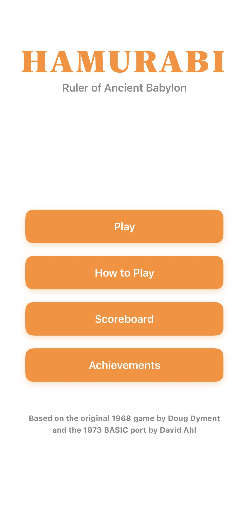
  &nbsp; &nbsp; &nbsp;
  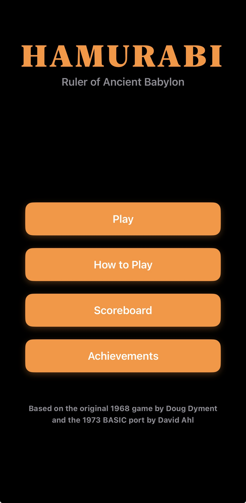
</p>

### How to Play (Tutorial)
A swipeable tutorial view that teaches new rulers the core mechanics of the game, including their ultimate goal, how the economy functions, and the dangers of nature.

<p align="center">
  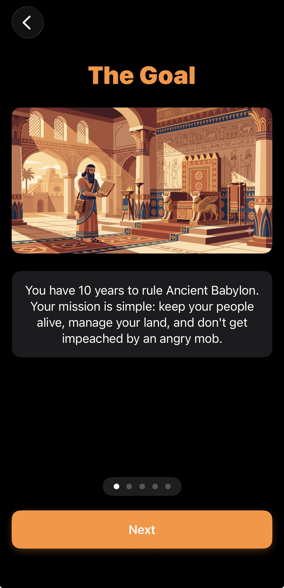
</p>

---

## 🌾 The Game Loop
The core game utilizes a state-driven step system. Your inputs dictate exactly which screen you will see next. Every input is strictly validated—you can only spend the resources you actually have, and you can quickly leave an input blank to submit `0`.

### 1. The Yearly Report
Your royal advisor summarizes the state of the city. This screen displays your available bushels, owned acres, current population, and reports on any random natural events (like plagues or grain-stealing rats) that occurred during the year.

<p align="center">
  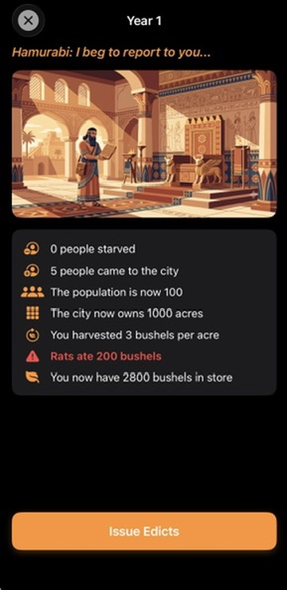
</p>

### 2. Buying Acres
Expand your territory. Land prices fluctuate every single year, and your maximum purchase power is automatically calculated and limited by your current bushel reserves. 

<p align="center">
  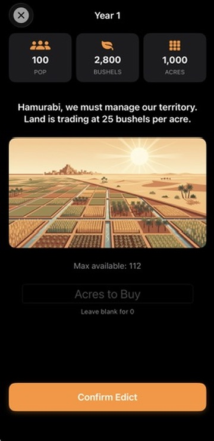
</p>

### 3. Selling Acres
If you choose to buy `0` acres, the game intelligently routes you to the Sell screen instead, allowing you to liquidate land for emergency bushels. 

<p align="center">
  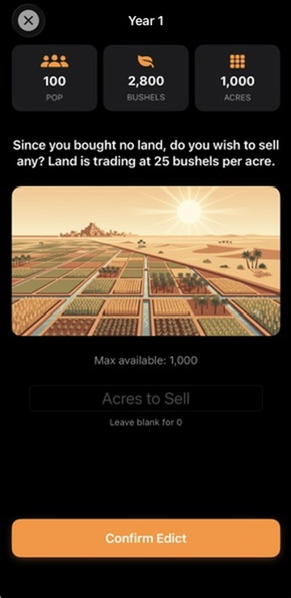
</p>

### 4. Feeding the People
Your most critical duty. Each citizen requires exactly 20 bushels to survive the year. 
*⚠️ **Warning:** If you fail to feed a large enough percentage of your population, they will riot and impeach you, instantly triggering a Game Over.*

<p align="center">
  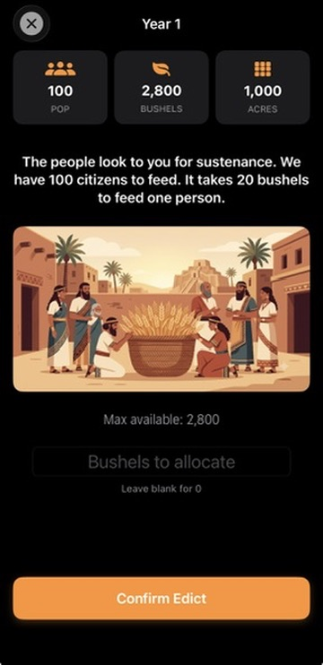
</p>

### 5. Planting Seeds
Invest in your future. You can use your purchased land to plant seeds for the next harvest. The maximum amount you can plant is a careful balance limited by your owned acres, your bushel reserves, and your workforce (1 citizen can work a maximum of 10 acres).

<p align="center">
  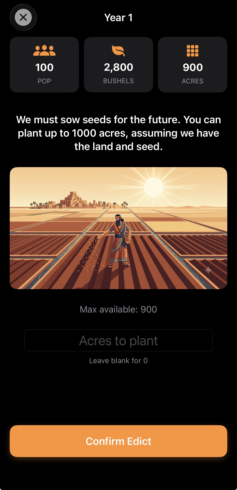
</p>

### 6. The Transition
A homage to the pacing of the original game. Before the complex harvest math is calculated, this screen builds suspense. From here, the game either loops back to the next Yearly Report or pushes you to the Endgame evaluation.

<p align="center">
  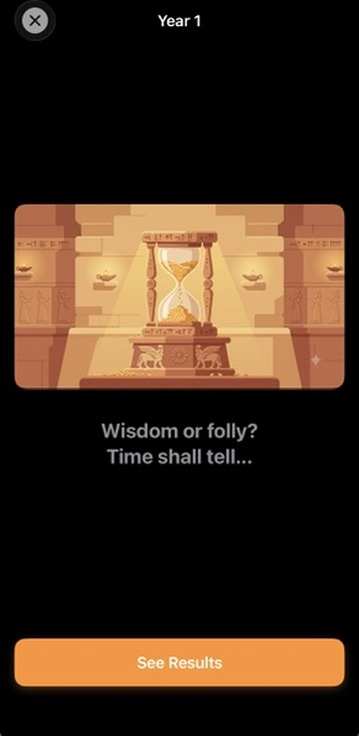
</p>

---

## 👑 The Endgame

### Game Over
Survive all 10 years, or perish trying. There are 4 possible game-over scenarios: 2 victory states and 2 defeat states. While impeachment can happen at any time, 3 of these scenarios are strictly reserved for judging your 10-year reign. The screen also seamlessly fires native toast notifications for any achievements you unlocked during the run!

<p align="center">
  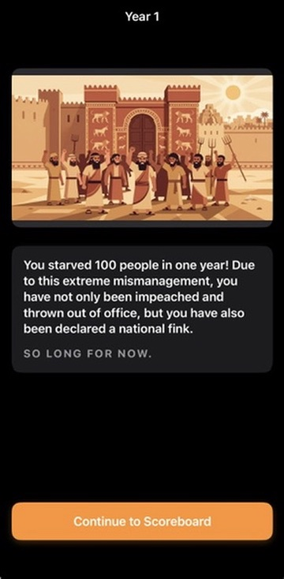
</p>

### Scoreboard
Powered by SwiftData, the scoreboard permanently tracks the Top 10 greatest games ever played on the device. Games are heavily weighted by Years Survived, and then sorted by final Population count. Reaching this screen straight from a Game Over will elegantly highlight your most recent run.

<p align="center">
  
</p>

### Achievements
Track your mastery of Babylon. This view features a dynamic progress bar tracking your completion percentage, followed by a cleanly divided list of your unlocked victories and the challenges that still await you.

<p align="center">
  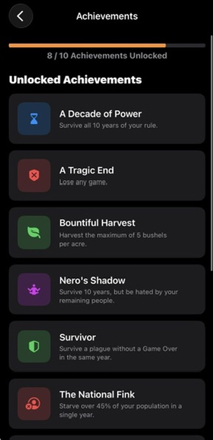
</p>
